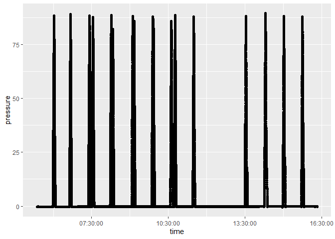
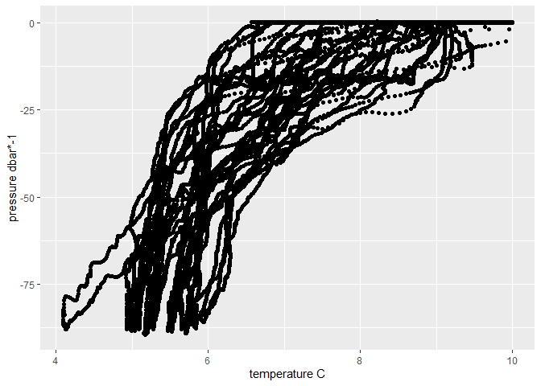

R Notebook
================

August 2023 - Bogoslof SeaBird Temperature/Pressure casts

Quick look at SeaBird cast data from field collections, August 6-11.

``` r
library(tidyverse)
```

    ## -- Attaching packages --------------------------------------- tidyverse 1.3.1 --

    ## v ggplot2 3.4.1      v purrr   0.3.4 
    ## v tibble  3.1.2      v dplyr   1.0.10
    ## v tidyr   1.2.0      v stringr 1.4.0 
    ## v readr   1.4.0      v forcats 0.5.1

    ## Warning: package 'ggplot2' was built under R version 4.1.3

    ## Warning: package 'tidyr' was built under R version 4.1.3

    ## Warning: package 'dplyr' was built under R version 4.1.3

    ## -- Conflicts ------------------------------------------ tidyverse_conflicts() --
    ## x dplyr::filter() masks stats::filter()
    ## x dplyr::lag()    masks stats::lag()

## Notes and to-dos

Need to convert pressure to depth

Need to change UTC to AK time to determine dates/times for each sampling
event (1-5).

Eddy field around Bogoslof - Jeremy could pull down the remote sensing
data - additional foraging corresponding to eddies

Monthly composite of chlorophyll for August

Argo float - subsurface current field

Ask PMEL if there is any data for this time period

Climate modelers at UW/PMEL Al Herman and Wei, running the models and
running the bias correction.

### Confirm that I have all the CTD data onboard.

``` r
cumulative_dat <- read_csv("../data/SBE39plus09899_2023-09-12.asc", skip = 11, col_names = F) %>%
  rename(temperature = X1, pressure = X2, date = X3, time = X4) %>%
  separate(date, into = c("day", "month", "year")) %>%
  filter(month != "Jul") # remove test data prior to Bogoslof
```

    ## 
    ## -- Column specification --------------------------------------------------------
    ## cols(
    ##   X1 = col_double(),
    ##   X2 = col_double(),
    ##   X3 = col_character(),
    ##   X4 = col_time(format = "")
    ## )

``` r
cumulative_dat %>%
  group_by(day, month) %>%
  tally() 
```

    ## # A tibble: 5 x 3
    ## # Groups:   day [5]
    ##   day   month     n
    ##   <chr> <chr> <int>
    ## 1 07    Aug   11750
    ## 2 08    Aug   41922
    ## 3 09    Aug   48942
    ## 4 10    Aug   67498
    ## 5 11    Aug   62507

``` r
cumulative_dat %>%
 filter(day %in% c(10, 11)) %>%
  ggplot(aes(x = time, y = pressure)) +
  geom_point()
```

<!-- -->

That looks like a pretty consistent signal on pressure/depth.

``` r
# for one sampling period
cumulative_dat %>%
  filter(day %in% c(10, 11)) %>%
  filter(pressure != 0) %>%
  filter(temperature < 10) %>%
  ggplot(aes(x = temperature, y = -1*pressure)) +
  geom_point() + 
  labs(x = "temperature C",
       y = "pressure dbar*-1")
```

<!-- -->

Convert between UTC and AK time by subtracting 8 hours.
